# TiDB-Grafana定位TiDB实例状态
time : 2021-07-18

1. CPS 隐藏视图,查看理论能力和实际能力差距
位置：
意义：
阈值：

2. faild query 看看各个 1248 错误码，分析下失败的 SQL
可以看下 Grafana 监控中 Overview -> TiDB -> Failed Query OPM 的监控，并根据 query 的错误号查一下看
我在仪表盘上面监控的时候发现，QPS图表显示的Queries error情况，天天都有，而且定量，日志也查不到。我想知道怎么解决，希望知道的大神告诉一下。
kv 1062 代表有冲突，在 tidb.log 中搜关键字 conflict 和 retry，查找相关 SQL
连接数可以看 TiDB 监控中 server 面板下有 connection count。
4000以下与 MySQL 一一对应，[参考 MySQL 官网错误码解释](https://dev.mysql.com/doc/mysql-errors/5.7/en/error-reference-introduction.html)
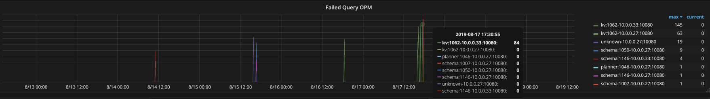
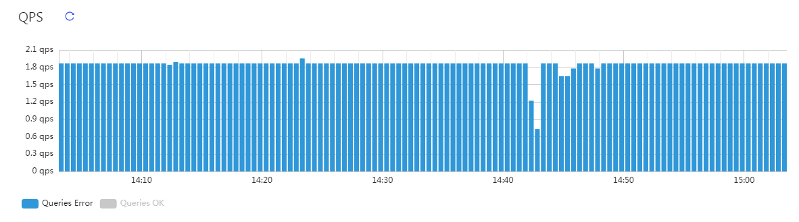

3. idle duration 应用睡觉，每隔多少秒给TiDB 发一条 SQL
位置：
意义：
阈值：
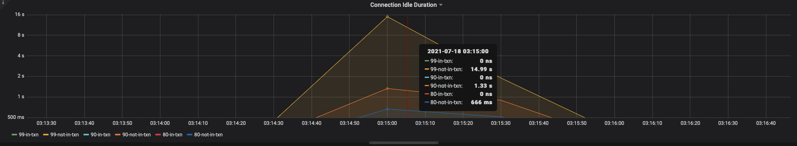

4. CPU usage 查看 单个 tidb 实例所占的，cpu usage 进程占用 CPU 
位置：
意义：
阈值：
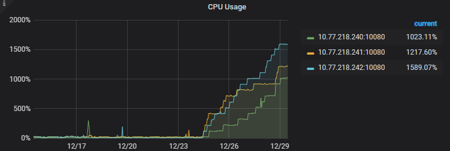

5. token duration 3ms算有问题的，1000，应用获取 token 的时间
位置：
意义：
阈值：
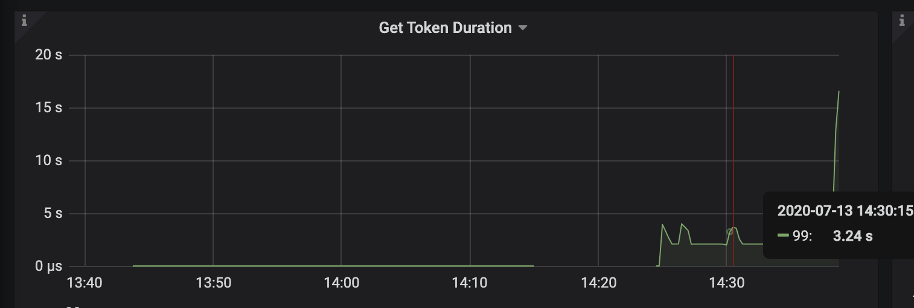

6. general 用户生成的，internal 是我们内部的 
位置：
意义：
阈值：
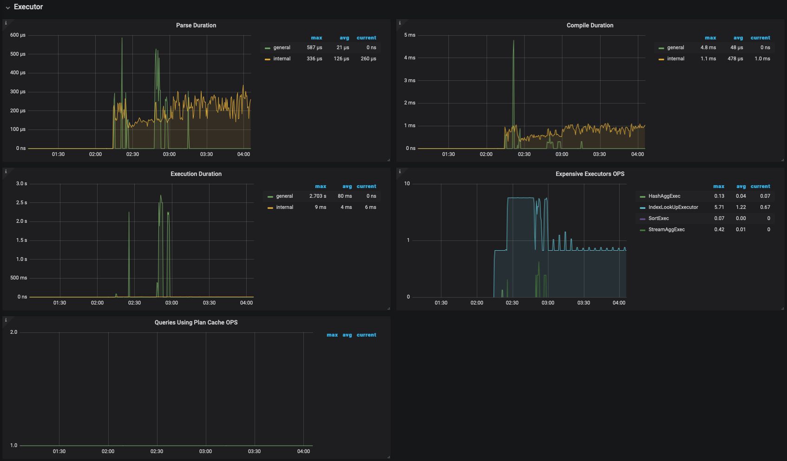

7. TPS rollback 是主动失败，互连网 关注 QPS
位置：
意义：
阈值：
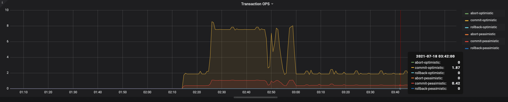

8. txn region number 可以看出是否有热点，TIDB 都在和那些 TIKV IP  节点交互
位置：
意义：
阈值：

9. kv request duration 99 by type
位置：
意义：
阈值：

9. TIDB 获取数据时间、tikv-grpc 时间差
位置：
意义：
阈值：
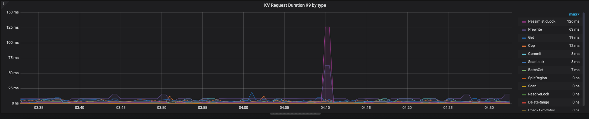
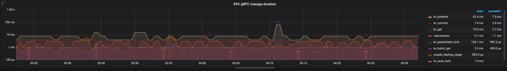

10. pd duration  几百ms才算高
位置：
意义：
阈值：
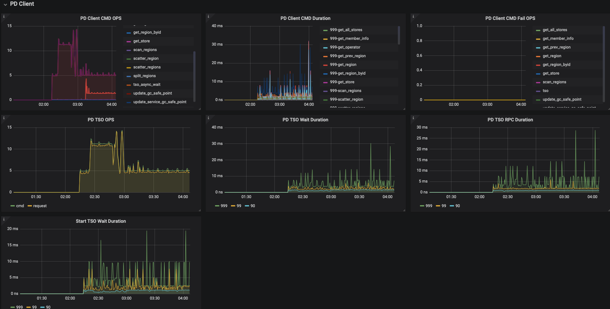

11. thread CPU 70%~80% 算高的
位置：
意义：
阈值：
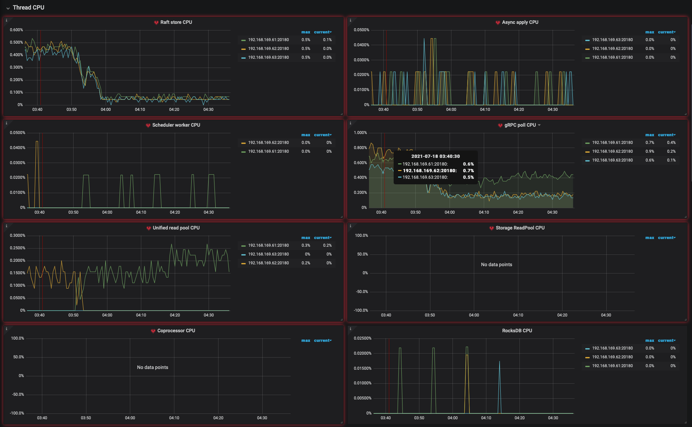

https://asktug.com/t/topic/147
https://asktug.com/t/topic/68093