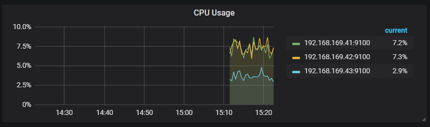
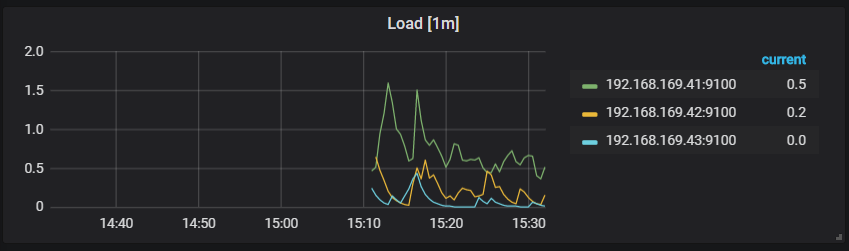
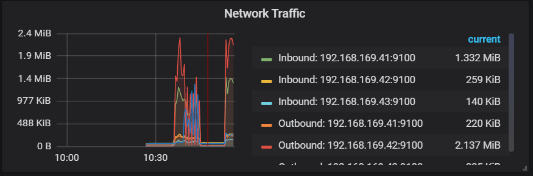
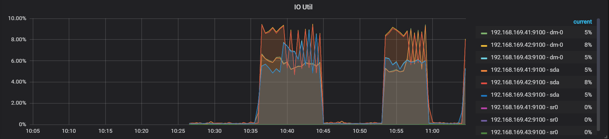

# TiDB-Grafana监控解读之Overview

## SystemInfo

#### CPU usage
涵义: 每台服务器的CPU的使用率 
作用: 用于评估每台服务器总体的 CPU 压力情况
标准: 使用率超过 80%，很大程度上 CPU 可能就是系统瓶颈  

#### CPU Load
涵义: 每台服务器的CPU的使用率 
作用: 
标准: CPU 的 Load 应该小于 CPU vCore 的个数，否则可能会成为系统的瓶颈    

#### Memory Avaliable
涵义: 每台服务器的内存可用率 
作用: 评估内存使用情况
标准: TiKV 单节点内存使用率应该 < 60%
      TiDB 节点空余服务器内存 20%    

#### Network Traffic 网络流量
涵义:  
作用: 评估当前每台服务器的网络情况
标准: 当前网络带宽不要被打满，如果是万兆网卡(10000Mbps)也就是每秒下载速度为1250M/s,[参考万兆网卡查询方法](https://github.com/jansu-dev/TiDB-Learning-Notes/blob/master/TIDB-%E9%83%A8%E7%BD%B2%E5%AE%9E%E8%B7%B5/TiDB-%E9%9B%86%E7%BE%A4%E9%83%A8%E7%BD%B2%E5%89%8D%E7%8E%AF%E5%A2%83%E6%A3%80%E6%B5%8B.md)   

#### IO Util I/O使用情况
涵义:  
作用: 评估当前每台服务器的I/O使用情况
标准:   
  - I/O最好不要超过 80%，否则很有可能变为系统瓶颈  
  - 在 80%~90% 之间时，可以考虑通过加节点横向扩展方式解决问题   

#### TCP Retrans 
涵义: TCP重传数量统计情况  
作用: 评估网络传输失误率，查出多余TCP信息流
标准: 网络丢包可能会导致 TCP 的大量重传     

## 参考文章

[tidb v4.0.2 监控显示TCP Retrans 90%以上是什么原因？](https://asktug.com/t/topic/36320)

