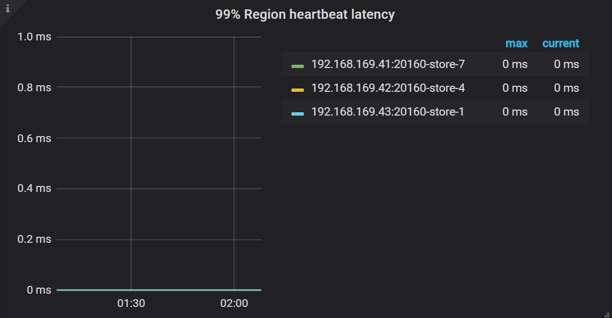
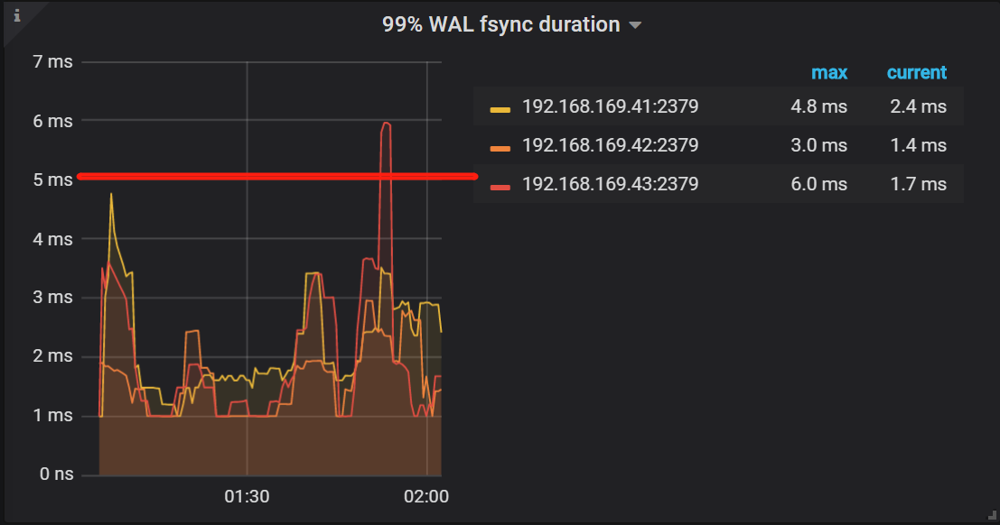

# TiDB-Grafana监控解读之PD

时间：2021-01-31

## Summary

 - **Cluster**
>  - [HealthRegion](#HealthRegion)  
 - **etcd**
>  - [WAL_fsync_duration](#WAL_fsync_duration)  
 - **HeartBeat**
>  - [99_gRPC_message_duration](#99_gRPC_message_duration)  

#### HealthRegion 
涵义: 每个Region的状态     
作用: 同涵义    
标准: 
  - pending 的 peer 应该少于 100   
  - miss 的 peer 不能一直大于 0   

   

### etcd   

#### WAL_fsync_duration
涵义: 表示 PD 刷盘的延时是多少，如果刷盘延时特别高且是 Leader 的情况下，很有可能 PD 的瓶颈       
作用: PD 是 TSO 来源，如果 PD 的刷盘特别慢，很有可能导致整体数据库卡顿    
标准: WAL 刷盘延时最好小于 5ms     

   

### HeartBeat

#### 99_gRPC_message_duration 

涵义: 反应所有 Region 发向 PD 的心跳延迟，如果 Region 有几百万个，短时间发送大量心跳信息 PD 可能处理不过来       
作用: 判断 Region 是否在心跳处理部分出现瓶颈       
标准: 99% 的心跳延时最好低于 5ms   

   

