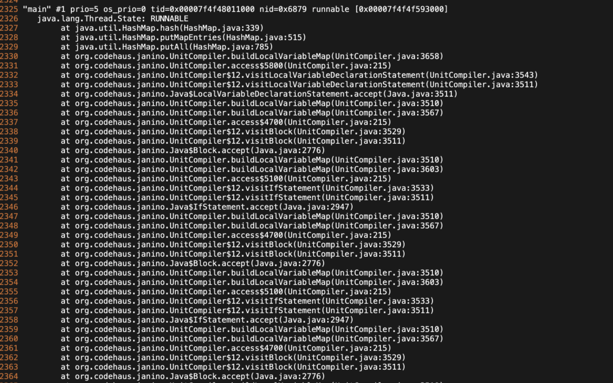

# TiDB-TiSpark OOM 问题
时间:2021-03-22

spark-env.yml 是集群资源   

具体启动一个spark app的时候还可以指定内存
需要调整的就是实际启动spark app时候的内存
包括 driver 内存 executor 内存

建议 driver 4-8g
13:20
executor 每个core给 2-4g
executor对应一个jvm

启动thrift的时候可以指定
13:22
也可以通过配置文件指定默认值

executor-memory executor-core代表每个jvm的参数
num-executor代表多少个jvm

