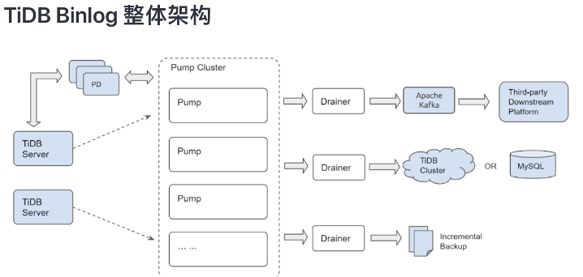
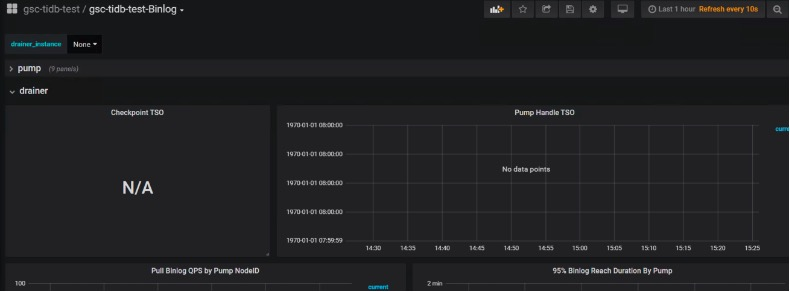

UAS 项目读写分离待确认问题点

1.	宽表 Load 数据有无延迟？

 

答案：
会有延迟
原因：
如上图：TiDB Binlog 整体架构图所示，Drainer 是个单点，并发写入能力有限。Drainer写入能力最高每条几万条,预估延迟在小时级别。

2.	读写分事务离后能否保证？

答案：
不能严格保证
原因：
	依据经验TiDB Binglog的主备延迟在秒(s)级别。如果原应用存在同一个事务中既包含OLTP SQL，又包含OLAP SQL的情况，需要应用侧做业务拆分，并将 TiDB 的延迟考虑在内，数据库能做的仅是同步主备间同步数据。（Oracle DataGuard 也无法保证）

3.	TiDB Binlog有无图形化监控？

 
 

答案：
有监控信息

	监控信息：
		官网说明：https://docs.pingcap.com/zh/tidb/v4.0/monitor-tidb-binlog-cluster
