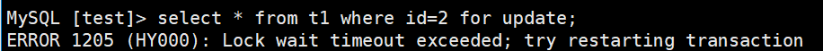

# TiDB-5.0.0-rc 新特性  
时间：2021-02-16   
版本：5.0.0-rc   


## Summary  

> - [5版本关键特性](#5版本关键特性)    
> - [开启聚簇索引功能](#开启聚簇索引功能)    
> - [开启异步提交事务功能](#开启异步提交事务功能)    
> - [优化EXPLAIN功能](#优化EXPLAIN功能)    
> - [引入不可见索引功能](#引入不可见索引功能)    
> - [备份文件到S3与GCS并恢复](#备份文件到S3与GCS并恢复)    
> - [过提升优化器的稳定性及限制系统任务对资源的占用，降低系统的抖动](#过提升优化器的稳定性及限制系统任务对资源的占用，降低系统的抖动)    
> - [引入Raft_Joint_Consensus算法，确保Region成员变更时系统的可用性](#引入Raft_Joint_Consensus算法，确保Region成员变更时系统的可用性)    
> - [参考文章](#参考文章)    

## 5版本关键特性   

功能特性：  

1. 开启聚簇索引功能
2. 开启异步提交事务功能  
3. 优化EXPLAIN功能    
4. 引入不可见索引功能    
5. 支持EXCEPT和INTERSECT操作符
6. 备份文件到S3与GCS并恢复   

内部特性：    

1. 过提升优化器的稳定性及限制系统任务对资源的占用，降低系统的抖动
2. 引入Raft_Joint_Consensus算法，确保Region成员变更时系统的可用性     


## 开启聚簇索引功能   

| v5.0 之前限制 | v5.0.0-rc限制 |
| - | - |
| 表设置主键 | 无 |
| 主键类型为 INTEGER 或 BIGINT | 无 |
| 主键只有一列 | 无 |

 - 关闭 clustered_index 特性（同 4.0.x 部分主键聚簇索引特性一样）：   
 仅支持主键为 INTEGER 或 BIGINT、主键只有一列的聚簇索引，当条件不满足时，便采用一个 64 位 handle 值代替主键组织数据，也就是 _row_id；  
 下列 demo 中 t1 表的查询行为表现为从 TiKV 获取解压的 KV 数据在 TiDB 中直接筛选过滤便获得结果；    
 而 t2 表的查询行为表现为 TiDB 先从 TiKV 中获得主键索引页子节点中 guid 列的 _row_id 值，再从 TiKV 中获取改行数据对应数据；    
    - 非主键列查询  
      ```sql
      -- 表 t1 为索引组织表、表 t2 为普通表   
      -- 聚簇索引组织表
      MySQL [jan]> create database jan;
      
      MySQL [jan]> CREATE TABLE t1(id bigint not null primary key       auto_increment,
        b char(100),
        index(b));
      
      
      MySQL [jan]> INSERT INTO t1 VALUES (1, 'aaa'), (2, 'bbb');
      
      MySQL [jan]> EXPLAIN SELECT * FROM t1 WHERE id = 1;
      +-------------+---------+------+---------------+---------------+
      | id          | estRows | task | access object | operator info |
      +-------------+---------+------+---------------+---------------+
      | Point_Get_1 | 1.00    | root | table:t1      | handle:1      |
      +-------------+---------+------+---------------+---------------+

      
      -- 非聚簇索引组织表
      MySQL [jan]> CREATE TABLE t2 (
       guid CHAR(32) NOT NULL PRIMARY KEY,
       b CHAR(100),
       INDEX(b)
      );
      
      MySQL [jan]> INSERT INTO t2 VALUES ('02dd050a978756da0aff6b1d1d7c8aef', 'aaa'), ('35bfbc09cb3c93d8ef032642521ac042', 'bbb');
      
      MySQL [jan]> EXPLAIN SELECT * FROM t2 WHERE guid = '02dd050a978756da0aff6b1d1d7c8aef';
      +-------------+---------+------+-------------------------------+---------------+
      | id          | estRows | task | access object                 | operator info |
      +-------------+---------+------+-------------------------------+---------------+
      | Point_Get_1 | 1.00    | root | table:t2, index:PRIMARY(guid) |               |
      +-------------+---------+------+-------------------------------+---------------+

      ```  
      - 主键列查询    
      对于索引组织表 t1 中非主键列查询，执行计划为在 TiKV 中扫描索引获取结果，在 TiDB 中过滤直接获得数据；    
      而在非索引组织表 t2 中，执行计划为在 TiKV 中全表扫描 t2 并过滤后符合条件的行，最后在 TiDB 中过滤索要查询的列数据返回给客户端；    
      可见因为是 5.0.0-rc（或5.0.0-rc关闭该特性） 之前不支持不符合条件的聚簇索引，因此 t2 表在建表时语句 INDEX(b) 被忽略。     
      ```sql
      MySQL [jan]> EXPLAIN SELECT id FROM t1 WHERE b = 'aaaa';
      +--------------------------+---------+-----------+----------------------+-------------------------------------------------------+
      | id                       | estRows | task      | access object        | operator info                                         |
      +--------------------------+---------+-----------+----------------------+-------------------------------------------------------+
      | Projection_4             | 0.00    | root      |                      | jan.t1.id                                             |
      | └─IndexReader_6          | 0.00    | root      |                      | index:IndexRangeScan_5                                |
      |   └─IndexRangeScan_5     | 0.00    | cop[tikv] | table:t1, index:b(b) | range:["aaaa","aaaa"], keep order:false, stats:pseudo |
      +--------------------------+---------+-----------+----------------------+-------------------------------------------------------+
      
      MySQL [jan]> EXPLAIN SELECT guid FROM t2  WHERE b = 'aaaa';
      +---------------------------+---------+-----------+---------------+--------------------------------+
      | id                        | estRows | task      | access object | operator info                  |
      +---------------------------+---------+-----------+---------------+--------------------------------+
      | Projection_4              | 0.00    | root      |               | jan.t2.guid                    |
      | └─TableReader_7           | 0.00    | root      |               | data:Selection_6               |
      |   └─Selection_6           | 0.00    | cop[tikv] |               | eq(jan.t2.b, "aaaa")           |
      |     └─TableFullScan_5     | 2.00    | cop[tikv] | table:t2      | keep order:false, stats:pseudo |
      +---------------------------+---------+-----------+---------------+--------------------------------+
      ```

 - 操作 clustered-index 特性
    ```sql  
     -- 查询表是否有聚簇索引，{tbl_name} 替换为所要查询的表名   
     select tidb_pk_type from information_schema.tables where  table_name = '{tbl_name}';   

     -- 查看 clustered-index 特性是否开始   
     show session variables like 'tidb_enable_clustered_index';

     show global variables like 'tidb_enable_clustered_index';

     -- 打开 clustered-index 特性   
     set global tidb_enable_clustered_index = 1;

     -- 关闭 clustered-index 特性   
     set global tidb_enable_clustered_index = 0;
    ```

 - 开启 clustered-index 特性   
    - 非主键列查询    
    在开始 clustered-index 特性后的 5.0.0-rc TiDB 中，非主键列查询执行计划为一次从 TiKV 中查询符合主键索引组织表获取数据后，在 TiDB 端直接返回给客户端；   
      ```sql
       MySQL [jan]> CREATE TABLE t3 (
        key_a INT NOT NULL,
        key_b INT NOT NULL,
        b CHAR(100),
        PRIMARY KEY (key_a, key_b)
       );
       
       MySQL [jan]> INSERT INTO t3 VALUES (1, 1, 'aaa'), (2, 2, 'bbb');
       
       MySQL [jan]> EXPLAIN SELECT * FROM t3 WHERE key_a = 1 AND key_b = 2;
       +-------------+---------+------+---------------------------------------+---------------+
       | id          | estRows | task | access object                         | operator info |
       +-------------+---------+------+---------------------------------------+---------------+
       | Point_Get_1 | 1.00    | root | table:t3, index:PRIMARY(key_a, key_b) |               |
       +-------------+---------+------+---------------------------------------+---------------+
      ```
 - 聚簇索引的缺点   
 开启聚簇索引后，主键代替64 位的 handle 值 _row_id 代表每一行，可能会导致存储空间的上升，尤其是表中存在许多二级索引时；   
 如下表 demo 表 t1 主键的类型为 char(32)，那么索引大约需要 8+32 = 40 （b 列宽 + 主键列宽）个字节，如果是普通索引仅需 8 + 8 = 16 （b 列宽 + _row_id 列宽）个字节；   
    - demo
       ```sql
        CREATE TABLE t1 (
         guid CHAR(32) NOT NULL PRIMARY KEY,
         b BIGINT,
         INDEX(b)
        );
       ```
 - 聚簇索引的优点   
    - 插入数据时会减少一次从网络写入索引数据，因为主键索引就是表结构，与普通索引不同，减少了主键索引的写次数；   
    - 等值条件查询仅涉及主键时会减少一次从网络读取数据，因为主键代替了 _row_id 作为内部行指针，避免了二次回表的网络操作；      
    - 范围条件查询仅涉及主键时会减少多次从网络读取数据，同等值条件查询原理相同，范围条件查询减少了多次回表；   
    - 等值或范围条件查询涉及主键的前缀时会减少多次从网络读取数据，原理同范围条件查询；   


## 开启异步提交事务功能  

 - 异步提交解决的问题    
 首先，TiDB 在很多情况下，一个事务中含有很多条 SQL 语句，而业务又要求 TPS 的延迟维持在 100ms 以下。因此，出于性能考虑在 TiDB 5.0.0-rc 给出了异步提交事务的解决方案；  
 其次，回顾一下 2PC 的发起时间与交互过程，详情参考文章 [老叶茶馆：浅析TiDB二阶段提交](https://blog.csdn.net/n88lpo/article/details/105235997) 讲解的 TiDB 2PC 过程；  
   
 内部原理为只要 2PC 的 prewrite 完成，TiDB 便可返回给客户端结果，而后 Commit 阶段采用 async 异步的方式提交,对应图中的 1~7 步；      


 - 异步提交存在的问题  
  截图链接：[Github：Async Commit ](https://github.com/tikv/tikv/issues/8316#issuecomment-664108977)   
  
   当 Client 尝试获取数据时被锁，可能对应超时、提交、回滚 3种状态；    
    |    
    |— — 提交：提交后事务结束，锁消失；   
    |— — 回滚：回滚后事务结束，锁消失；   
    |__  __ 超时：如果出现处理超时，TiDB 自动进入恢复过程（也就是重试）直到事务提交或回滚为止；普遍情况下，发起 2PC 后，经历过 prewrite 后会很快提交，所以只有想要读取消息（事务加锁消息）发生之前的客户端会处于恢复过程，也就是内部的不断重试；        
            
    &nbsp;&nbsp;&nbsp;&nbsp;&nbsp;&nbsp;&nbsp;&nbsp;&nbsp;&nbsp;**注意：这里的重试不是最后在命令行回显的超时，如下图："ERROR 1205 (HY000): Lock wait timeout exceeded; try restarting transaction"，而是存在于 TiDB 内部的重试，可以通过 max-retry-count 参数控制悲观事务中单个语句最大重试次数**，详情参考[官方文档-TiDB参数 ：max-retry-count](https://docs.pingcap.com/zh/tidb/v5.0/tidb-configuration-file#max-retry-count)；    
    
   - 操作步骤  
     | session 1 | session 2 | 备注 |
     | - | - | - |
     | create table (id int,name varchar(20)); |  |  |
     | insert into t1 values (2,'test_2'); |  |  |
     | begin; |  |  |
     |  | begin; |  |
     | select * from t1 where id=2 for update; |  |  |
     |  | select * from t1 where id=2 for update; | session 2 的查询语句 hang 住，因为 session 1 加了行锁； |
     | commit; |  | 随着 session 1 的提交， session 2 在未超过悲观锁内部重试最大限制次数前提下，获取 id=2 行的数据；|
     |  | commit; |  |
 
   - 效果图
     


 - 异步提交存在的解决方案     

  [知乎：如何理解数据库的内部一致性和外部一致性？](https://www.zhihu.com/question/56073588)
  [知乎：TiDB使用了raft之后为什么还需要2PC?](https://www.zhihu.com/question/266759495)

 - 异步提交存在的使用   
    ```sql   
     MySQL [(none)]> show variables like 'tidb_enable_async_commit';
     +--------------------------+-------+
     | Variable_name            | Value |
     +--------------------------+-------+
     | tidb_enable_async_commit | ON    |
     +--------------------------+-------+
     
     MySQL [(none)]> set global tidb_enable_async_commit=1;
     
    ```

## 优化EXPLAIN功能


## 引入不可见索引功能  
DBA 调试和选择相对最优的索引时，可以通过 SQL 语句将某个索引设置成 Visible 或者 Invisible，修改后优化器会根据索引的可见性决定是否将此索引加入到索引列表中。    
 - 不可见索引注意事项   
    - “不可见” 是仅仅对优化器而言的，不可见索引仍然可以被修改或删除，也就是当插入删除数据时改索引也为同时维护着；  
    - 与 MySQL 类似，TiDB 不允许将主键索引设为不可见；   
    - MySQL 中提供的优化器开关 use_invisible_indexes=on 可将所有的不可见索引重新设为可见。该功能在 TiDB 中不可用；   
      ```sql
       MySQL [jan]> show variables like 'use_invisible_indexes';
       Empty set (0.00 sec)
       
       MySQL [jan]> set use_invisible_indexes=1;
       ERROR 1193 (HY000): Unknown system variable 'use_invisible_indexes'
      ``` 

 - 操作可见索引不可见    
 查询只能先走全报表扫描；  
 ```sql  
  MySQL [jan]> ALTER TABLE t1 ALTER INDEX idx_b1 INVISIBLE;  

  MySQL [jan]> SHOW CREATE TABLE t1\G
  *************************** 1. row ***************************
         Table: t1
  Create Table: CREATE TABLE `t1` (
    `id` bigint(20) NOT NULL AUTO_INCREMENT,
    `b` char(100) DEFAULT NULL,
    PRIMARY KEY (`id`),
    KEY `b` (`b`) /*!80000 INVISIBLE */
  ) ENGINE=InnoDB DEFAULT CHARSET=utf8mb4 COLLATE=utf8mb4_bin AUTO_INCREMENT=30002   

  MySQL [jan]> EXPLAIN SELECT id FROM t1 WHERE b = 'aaaa';
  +---------------------------+---------+-----------+---------------+--------------------------------+
  | id                        | estRows | task      | access object | operator info                  |
  +---------------------------+---------+-----------+---------------+--------------------------------+
  | Projection_4              | 0.00    | root      |               | jan.t1.id                      |
  | └─TableReader_7           | 0.00    | root      |               | data:Selection_6               |
  |   └─Selection_6           | 0.00    | cop[tikv] |               | eq(jan.t1.b, "aaaa")           |
  |     └─TableFullScan_5     | 2.00    | cop[tikv] | table:t1      | keep order:false, stats:pseudo |
  +---------------------------+---------+-----------+---------------+--------------------------------+
 ```

 - 操作不可见索引可见   
 查询可以先走索引扫描
 ```sql   
 MySQL [jan]> alter table t1 alter index b VISIBLE;

 MySQL [jan]> EXPLAIN SELECT id FROM t1 WHERE b = 'aaaa';
 +--------------------------+---------+-----------+----------------------+-------------------------------------------------------+
 | id                       | estRows | task      | access object        | operator info                                         |
 +--------------------------+---------+-----------+----------------------+-------------------------------------------------------+
 | Projection_4             | 0.00    | root      |                      | jan.t1.id                                             |
 | └─IndexReader_6          | 0.00    | root      |                      | index:IndexRangeScan_5                                |
 |   └─IndexRangeScan_5     | 0.00    | cop[tikv] | table:t1, index:b(b) | range:["aaaa","aaaa"], keep order:false, stats:pseudo |
 +--------------------------+---------+-----------+----------------------+-------------------------------------------------------+
 ```

## 支持EXCEPT和INTERSECT操作符   

 - 数据准备
 ```sql
  MySQL [jan]> create table t4 (
    id int,
    name varchar(20)
  );
  
  MySQL [jan]> create table t5 (
    id int,
    name varchar(20)
  );
  
  MySQL [jan]> insert into t4 values (1,'jan_1'),(2,'jan_2'),(3,   'jan_3');    
  MySQL [jan]> insert into t5 values (2,'jan_2'),(3,'jan_3'),(4,   'jan_4'),(5,'jan_5');     
  
  MySQL [jan]> select * from t4;
  +------+-------+
  | id   | name  |
  +------+-------+
  |    1 | jan_1 |
  |    2 | jan_2 |
  |    3 | jan_3 |
  +------+-------+
  3 rows in set (0.01 sec)
  
  MySQL [jan]> select * from t5;
  +------+-------+
  | id   | name  |
  +------+-------+
  |    2 | jan_2 |
  |    3 | jan_3 |
  |    4 | jan_4 |
  |    5 | jan_5 |
  +------+-------+
  ```
 - EXCEPT    
 EXCEPT 操作符是一个集合操作符，将两个查询语句的结果合并在一起，并返回在第一个查询语句中有但在第二个查询句中不存在的结果集；   
 ```sql
  MySQL [jan]> select * from t4 EXCEPT select * from t5;
  +------+-------+
  | id   | name  |
  +------+-------+
  |    1 | jan_1 |
  +------+-------+
 ```
 - INTERSECT  
 INTERSECT 操作符是一个集合操作符，返回两个或者多个查询结果集的交集；   
 ```sql
  MySQL [jan]> select * from t4 INTERSECT  select * from t5;
  +------+-------+
  | id   | name  |
  +------+-------+
  |    2 | jan_2 |
  |    3 | jan_3 |
  +------+-------+
 ```


## 备份文件到S3与GCS并恢复


## 过提升优化器的稳定性及限制系统任务对资源的占用，降低系统的抖动

## 引入Raft_Joint_Consensus算法，确保Region成员变更时系统的可用性

相对于上面的一次成员变更的算法，它只引入了一个过渡状态，叫做 joint consensus。当一个 Leader 收到成员变更的请求的时候，他首先会将 C-old 和 C-new 都放在 joint consensus 里面（我们叫做 C-old-new），作为一个 Raft Log 发送给其他的 Followers。当节点收到 Log，不需要等待 Log 被 committed，就可以使用最新的 C-new 配置了，但这时候，仍然只有 C-old 里面的集群能进行 Vote。如果这时候 Leader 当掉了，新选出来的节点 要不在 C-old 里面，要不在 C-old-new 里面，因为我们前面没约定 C-old-new 这个 Log 必须 committed。但无论是哪一种 Leader，C-new 这边的集群都不可能单边决策的

[唐刘：深入浅出 Raft - Membership Change](https://www.sohu.com/a/204153791_736949)   
[杭州.Mark：解读Raft（四 成员变更）](https://www.cnblogs.com/hzmark/p/raft_4.html)   
[返回主页Katsura's blog：Raft算法，从学习到忘记](https://www.cnblogs.com/hzmark/p/raft_4.html)   

## 参考文章   

 - [官方文档-TiDB 5.0 RC Release Notes](https://docs.pingcap.com/zh/tidb/v5.0/release-5.0.0-rc)  
 
 - [官方文档-聚簇索引使用方法](https://docs.pingcap.com/zh/tidb/v5.0/clustered-indexes#tidb-v50-%E5%89%8D%E6%94%AF%E6%8C%81%E9%83%A8%E5%88%86%E4%B8%BB%E9%94%AE%E4%BD%9C%E4%B8%BA%E8%81%9A%E7%B0%87%E7%B4%A2%E5%BC%95)  
