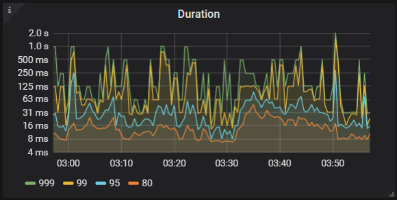
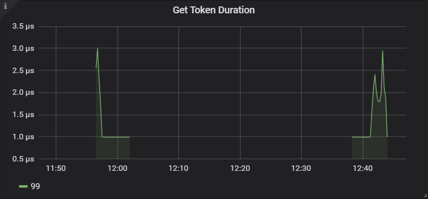
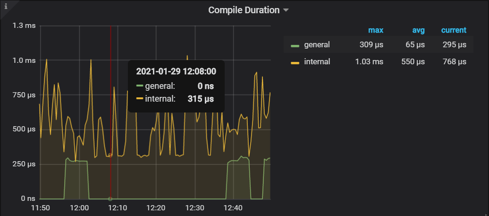
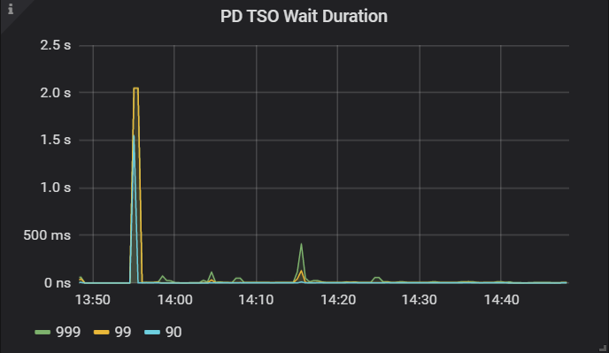
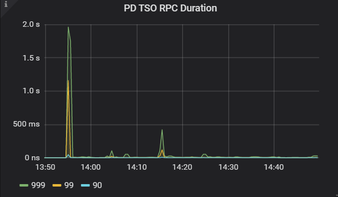

# TiDB-Grafana监控解读之TiDB
时间：2020-01-16

## Summary  
延迟部分 
> - [Query-Summary](#Query-Summary)  
>   - [Duration](#Duration) 
>   - [StatementsOPS](#StatementsOPS)  
>   - [CPS](#CPS)  
> - [Server](#Server)
>   - [ConnectionCount](#ConnectionCount)  
>   - [GetTokenDuration](#GetTokenDuration)  
> - [executer](#executer)
>   - [ParseDuration](#ParseDuration)  
>   - [CompileDuration](#ParseDuration)  
> - [PDClient](#PDClient)
>   - [PDTsoWaitDuration](#PDTsoWaitDuration)  
>   - [PDTsoRpcDuration](#PDTsoRpcDuration)  

错误部分   
> - [Query-Summary](#Query-Summary)  
>     - [FaildQueryOPM](#FaildQueryOPM)  
> - [KVErrors](#KVErrors)
>   - [LockResolveOPS](#LockResolveOPS)  
>   - [KVResolveOPS](#KVResolveOPS)  

## 延迟部分  

### Query-Summary

这一部分主要观察延迟、测试情况;

#### Duration  
涵义: 在横轴 SQL 执行时间点上，不同延迟百分位(99.9%、99%、95%、80%)的平均 SQL 执行延时  
作用:   
  - 对于 OLTP 业务而言，99 latency 应该小于 100ms     

#### StatementsOPS 
涵义: SQL 每秒的select、update、insert、show等不同类型SQL语句的执行数量；    
作用: 判断当前业务是写多，还是读多，便于处理性能问题  

#### CPS 
涵义: 判断 SQL 命令每秒的执行情况  
作用: 评估当前网络延迟来自于客户端，还是来自于服务端
标准: 
  - 理想情况：当 ideal CPS 和 query OK 差不多的时候，说明可以通过增加并发来增加 QPS  
  - 不理想情况：iedal CPS 和 query OK 差距较大，说明在并发一定的情况下，延迟出现在客户端    

### Server

#### ConnectionCount  
涵义：不同的 TiDB 节点当前连接数是多少   
作用：TiDB没有连接数限制，但是会出现排队现象，有利于再次相互排查   
标准: 

#### GetTokenDuration

涵义: 反映客户端请求，在获取 Token 时的时间耗费情况  
作用: 评估当前网络延迟来自于客户端，还是来自于服务端  
标准: 获取 Token 的时间最好小于 1ms ，否则最好检查配置文件中的 token-limit 配置，如：配置 500 并发，但是这是打过来 1000 的并发 token 请求    

### executer

#### ParseDuration

涵义: 反映在 TiDB 内部将 SQL CMD 解析成 AST 抽象语法树过程中所用的时间     
作用: 判单当前性能瓶颈是否与 TiDB 解析 SQL 慢有关，该阶段一般与 CPU 强相关  
标准: Parse Duartion 最好小于 10ms   

#### CompileDuration

涵义: 但应在 TiDB 内部，将 AST 经过逻辑改写及物理执行计划优化过程所用的时间    
作用: 判断当前性能瓶颈是否与 TIDB 内部 compile 阶段执行缓慢有关,该阶段一般与 CPU 强相关  
标准: Compile Duartion 最好小于 30ms       

## PDClient

#### PDTsoWaitDuration
涵义: 但应在 TiDB 内部，将 AST 经过逻辑改写及物理执行计划优化过程所用的时间    
作用: 判断当前性能瓶颈是否与 TIDB 内部 compile 阶段执行缓慢有关  
标准: PD TSO .99 分位等待时长最好小于 5ms       

#### PDTsoRpcDuration
涵义: TiDB 在去 PD 获取 TSO 的时候，竟然在 TiDB 这端发生了等待，此时极有可能TiDB存在一定的性能瓶颈    
作用: 判断当前 TiDB 是否存在性能瓶颈  
标准: PD TSO .99 分位等待时长最好小于 5ms       

错误部分

### Query-Summary

#### FaildQueryOPM    
涵义：不同 TiDB 节点的失败 SQL 的统计，例如语法错误、主键冲突等     
作用：如果出现每秒成败上前的失败 SQL 情况，就有必要追寻一下原因了，看看是否十是预期之内的失败 SQL，以免影响业务      

### KVErrors

#### LockResolveOPS
涵义: 当出现锁冲突每秒的解锁操作次数    
作用: 判断当前事务模式是否是符合当前业务的事务模式  
标准: 
  - 解决过期锁(expired、not experied、other confilcts)最好小于 500  
  - 如果冲突过多的情况下，建议使用悲观锁模式     

#### KVResolveOPS
涵义: 但应在 TiDB 内部，将 AST 经过逻辑改写及物理执行计划优化过程所用的时间    
作用: 判断当前性能瓶颈是否与 TIDB 内部 compile 阶段执行缓慢有关  
标准: txnLockFast、txnLock 选项最好小于 500 次       

