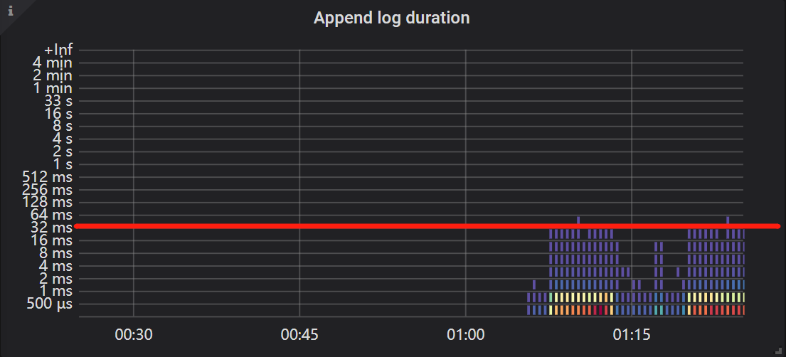
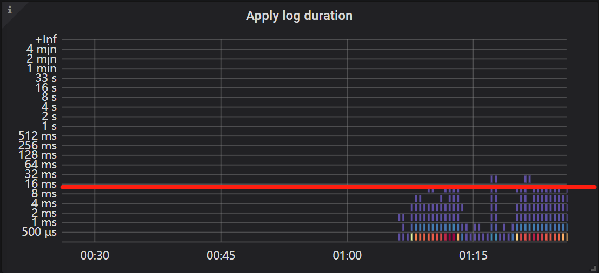
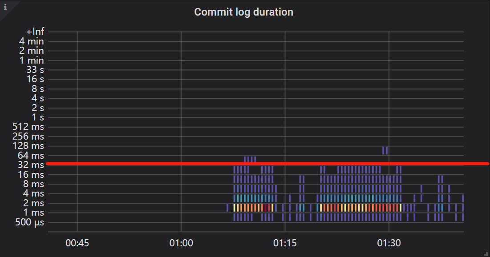
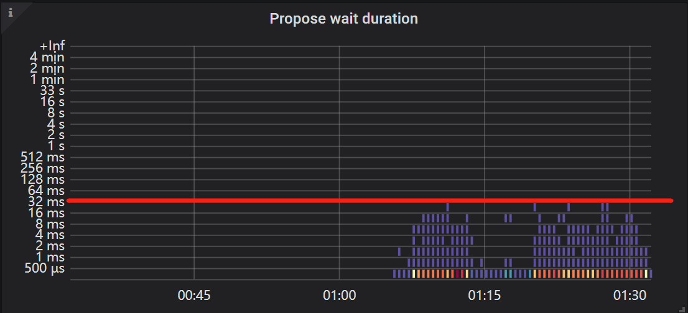

# TiDB-Grafana监控解读之TiKV
时间：2020-01-16

## Summary

 - **集群信息**
>  - [Regin](#Regin)  
 - **延迟**
>  - [99_gRPC_message_duration](#99_gRPC_message_duration)  
 - **CPU**
>  - [Raft_store_CPU](#Raft_store_CPU)  
>  - [Async_apply_CPU](#Async_apply_CPU)  
>  - [Scheduler_wroker_CPU](#Scheduler_wroker_CPU)  
>  - [gRPC_poll_CPU](#gRPC_poll_CPU)  
>  - [Unified_read_pool_CPU](#Unified_read_pool_CPU)  
>  - [Storage_read_pool_CPU](#Storage_read_pool_CPU)  
 - **Raft IO**
>  - [Append_log_duration](#Append_log_duration)  
>  - [Apply_log_duration](#Apply_log_duration)  
>  - [Commit_log_duration](#Commit_log_duration)   
 - **Raft Propose**
>  - [Propose_wait_duration](#Propose_wait_duration)  
>  - [Apply_wait_duration](#Apply_wait_duration)  

### Cluster

#### Regin
涵义: 反映 TiKV Region 的数量      
作用:   
标准: 单个 TiKV 的 Region 数量最好在 5 万个以下，否则推荐使用 region merge 功能，合并不必要的心跳开销、Raft 状态机开销         

### gRPC

#### 99_gRPC_message_duration

涵义: 反应 99% 的 gRPC 消耗的时间花在哪几类查询上面，并显示该类 gRPC 的平均耗时情况       
作用: 定位是否因 gRPC 消息导致性能瓶颈
标准: 每种 gRPC 消息越短越好  
  - 普通查询小于 100ms 属于正常情况  
  - 复杂 Coprocessor 也可以接收，如扫表等操作  
  - 普通查询超过 100ms 属于非正常情况          

### Thread_CPU

#### Raft_store_CPU  

涵义：  
作用：  
标准:  Raft store CPU 的使用率 < 75% * `raftstore.store-pool-size`     

#### Async_apply_CPU  

涵义：  
作用：  
标准: Async apply CPU 的使用率 < 75% * `raftstore.apply-pool-size`     

#### Scheduler_wroker_CPU  
 
涵义：大部分是计算相关的  
作用：  
标准:  Scheduler wroker CPU 的使用率 < 80% * `storage.scheduler-wroker-pool-size`     

#### gRPC_poll_CPU  
 
涵义：  
作用：  
标准:  gRPCpoll CPU 的使用率 < 80% * `server.grpc-concurrency`     

#### Unified_read_pool_CPU  

涵义：  
作用：  
标准:  Unified read pool CPU 的使用率 < 80% * `readpool.unified.max-thread-count`     

#### Storage_read_pool_CPU  

涵义： 
作用：  
标准: Storage ReadPool CPU 的使用率 < 80% * `readpool.storage.normal-concurrency`      
 

### Raft_IO

#### Append_log_duration  

涵义：TiKV 在写 Raft Log 过程中使用的时间  
作用：反映是否 TiKV 在写 Raft Log 的时候出现了问题     
标准: 99% 的延迟应该小于 10ms      

  

#### Apply_log_duration  

涵义：TiKV 在将数据从 Raft Log 写入 MemTable 的时间    
作用：反映是否当前数据写入出现了问题    
标准: Apply duration 的时间应该小于 30ms       

  

#### Commit_log_duration  

涵义：反应数据从发起一个 Raft 复制开始到满足多数派协议完成提交结束所等待的时间   
作用：判断是否因为网络原因导致 Raft 复制比较慢   
标准: 99% 的延时应该小于 30ms      

### Raft_propose

#### Propose_wait_duration  

涵义：TiKV 发起一个 Raft 请求发送到其他 TiKV 之后，从接受请求到开始处理请求中间所耗费的等待时间    
作用：反应当前 Raft 模块是否很繁忙导致当前系统卡顿，原因可能有IO、CPU   
标准: TiKV Propose Wait 的等待时间应该小于 20ms      

#### Apply_wait_duration  

涵义：Append 在写完 Raft Log 之后，什么时候开始将数据写入到 MemTable 中间所耗费的等待时间   
作用：反应当前系统 Apply 模块是否处于比较繁忙的状态  
标准: TiKV 的 Apply 等待时间应该小于 50ms      

