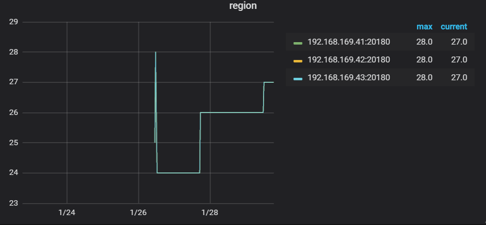
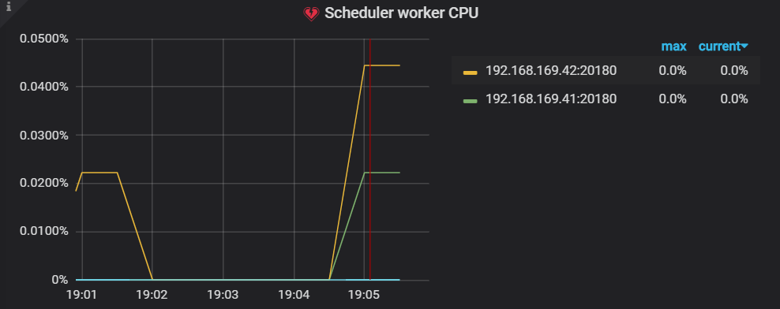

# TiDB-Grafana监控解读之TiKV
时间：2020-01-16

## Summary

 - **集群信息**
> - [Cluster](#Cluster)  
>    - [Regin](#Regin)  
 - **延迟**
> - [gRPC](#gRPC)  
>    - [99_gRPC_message_duration](#99_gRPC_message_duration)  
 - **CPU**
> - [Thread_CPU](#Thread_CPU)  
>    - [Raft_store_CPU](#Raft_store_CPU)  
>    - [Async_apply_CPU](#Async_apply_CPU)  
>    - [Scheduler_wroker_CPU](#Scheduler_wroker_CPU)  
>    - [gRPC_poll_CPU](#gRPC_poll_CPU)  
>    - [Unified_read_pool_CPU](#Unified_read_pool_CPU)  
>    - [Storage_read_pool_CPU](#Storage_read_pool_CPU)  
 - **错误**
> - [gRPC](#gRPC)  
>    - [99_gRPC_message_duration](#99_gRPC_message_duration)  

### Cluster

#### Regin
涵义: 反映 TiKV Region 的数量      
作用: 
标准: 单个 TiKV 的 Region 数量最好在 5 万个以下，否则推荐使用 region merge 功能，合并不必要的心跳开销、Raft 状态机开销         

### gRPC

#### 99_gRPC_message_duration

涵义: 反应 99% 的 gRPC 消耗的时间花在哪几类查询上面，并显示该类 gRPC 的平均耗时情况       
作用: 定位是否因 gRPC 消息导致性能瓶颈
标准: 每种 gRPC 消息越短越好  
  - 普通查询小于 100ms 属于正常情况  
  - 复杂 Coprocessor 也可以接收，如扫表等操作  
  - 普通查询超过 100ms 属于非正常情况          

### Thread_CPU

#### Raft_store_CPU  

涵义：
作用：
标准:  Raft store CPU 的使用率 < 75% * `raftstore.store-pool-size`   

#### Async_apply_CPU  

涵义：
作用：
标准: Async apply CPU 的使用率 < 75% * `raftstore.apply-pool-size`   

#### Scheduler_wroker_CPU  
 
涵义：大部分是计算相关的
作用：
标准:  Scheduler wroker CPU 的使用率 < 80% * `storage.scheduler-wroker-pool-size`   

#### gRPC_poll_CPU  
 
涵义：
作用：
标准:  gRPCpoll CPU 的使用率 < 80% * `server.grpc-concurrency`   

#### Unified_read_pool_CPU  

涵义：
作用：
标准:  Unified read pool CPU 的使用率 < 80% * `readpool.unified.max-thread-count`   

#### Storage_read_pool_CPU  

涵义：
作用：
标准:  Storage ReadPool CPU 的使用率 < 80% * `readpool.storage.normal-concurrency`   

### Raft_IO

#### Append_log_duration  

涵义：
作用：
标准:  Unified read pool CPU 的使用率 < 80% * `readpool.unified.max-thread-count`   

   

#### Applay_log_duration  

涵义：
作用：
标准:  Unified read pool CPU 的使用率 < 80% * `readpool.unified.max-thread-count`   

#### Commit_log_duration  

涵义：
作用：
标准:  Unified read pool CPU 的使用率 < 80% * `readpool.unified.max-thread-count`   

### Raft_propose

#### Propose_wait_duration  

涵义：
作用：
标准:  Unified read pool CPU 的使用率 < 80% * `readpool.unified.max-thread-count`   

#### Apply_wait_duration  

涵义：
作用：
标准:  Unified read pool CPU 的使用率 < 80% * `readpool.unified.max-thread-count`   

### Errors  

#### Server is busy  

涵义：每个 TiKV 实例上 gRPC 消息失败的个数；         
作用：网络问题定位，grpc 消息在TiDB集群中时时刻刻在发生；      

